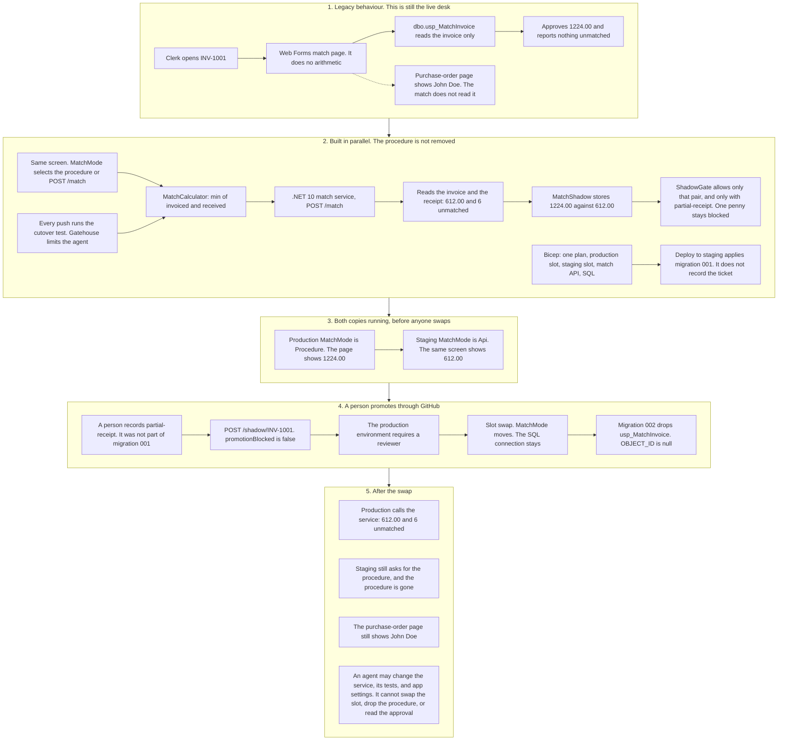

```mermaid
flowchart TB
  subgraph legacy [1. Legacy behaviour. This is still the live desk]
    Clerk["Clerk opens INV-1001"]
    Screen["Web Forms match page. It does no arithmetic"]
    Proc["dbo.usp_MatchInvoice reads the invoice only"]
    Old["Approves 1224.00 and reports nothing unmatched"]
    Po["Purchase-order page shows John Doe. The match does not read it"]
    Clerk --> Screen --> Proc --> Old
    Screen -.-> Po
  end

  subgraph parallel [2. Built in parallel. The procedure is not removed]
    Mode["Same screen. MatchMode selects the procedure or POST /match"]
    Calc["MatchCalculator: min of invoiced and received"]
    Api[".NET 10 match service, POST /match"]
    Read["Reads the invoice and the receipt: 612.00 and 6 unmatched"]
    Shadow["MatchShadow stores 1224.00 against 612.00"]
    Gate["ShadowGate allows only that pair, and only with partial-receipt. One penny stays blocked"]
    Tests["Every push runs the cutover test. Gatehouse limits the agent"]
    Bicep["Bicep: one plan, production slot, staging slot, match API, SQL"]
    Deploy["Deploy to staging applies migration 001. It does not record the ticket"]
    Mode --> Calc --> Api --> Read --> Shadow --> Gate
    Tests --> Calc
    Bicep --> Deploy
  end

  subgraph both [3. Both copies running, before anyone swaps]
    ProdBefore["Production MatchMode is Procedure. The page shows 1224.00"]
    StageBefore["Staging MatchMode is Api. The same screen shows 612.00"]
    ProdBefore --> StageBefore
  end

  subgraph promote [4. A person promotes through GitHub]
    Ticket["A person records partial-receipt. It was not part of migration 001"]
    Check["POST /shadow/INV-1001. promotionBlocked is false"]
    Reviewer["The production environment requires a reviewer"]
    Swap["Slot swap. MatchMode moves. The SQL connection stays"]
    Drop["Migration 002 drops usp_MatchInvoice. OBJECT_ID is null"]
    Ticket --> Check --> Reviewer --> Swap --> Drop
  end

  subgraph after [5. After the swap]
    ProdAfter["Production calls the service: 612.00 and 6 unmatched"]
    StageAfter["Staging still asks for the procedure, and the procedure is gone"]
    Still["The purchase-order page still shows John Doe"]
    Agent["An agent may change the service, its tests, and app settings. It cannot swap the slot, drop the procedure, or read the approval"]
  end

  legacy --> parallel --> both --> promote --> after
```